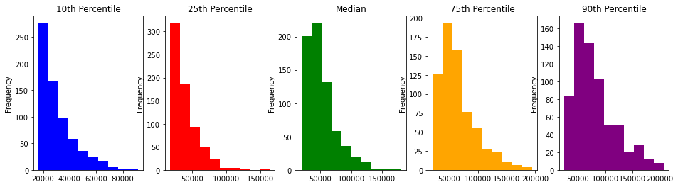
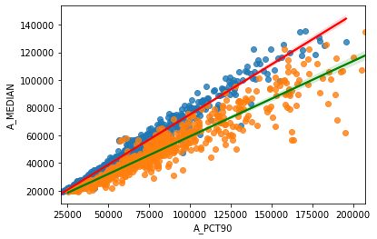
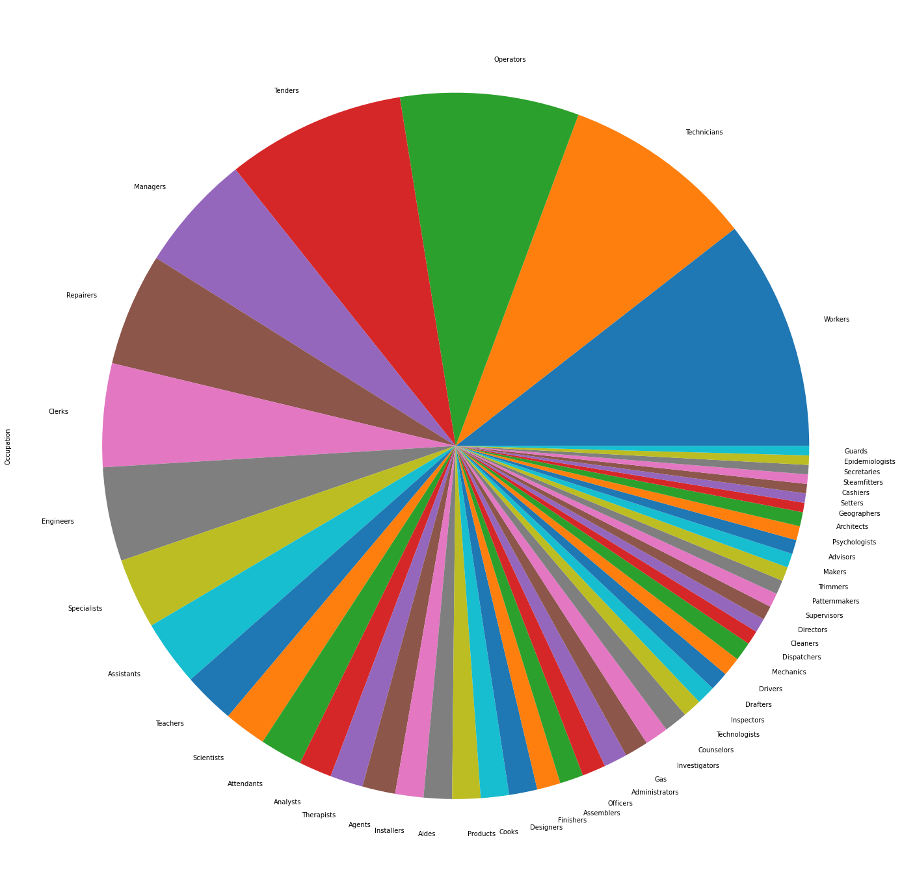
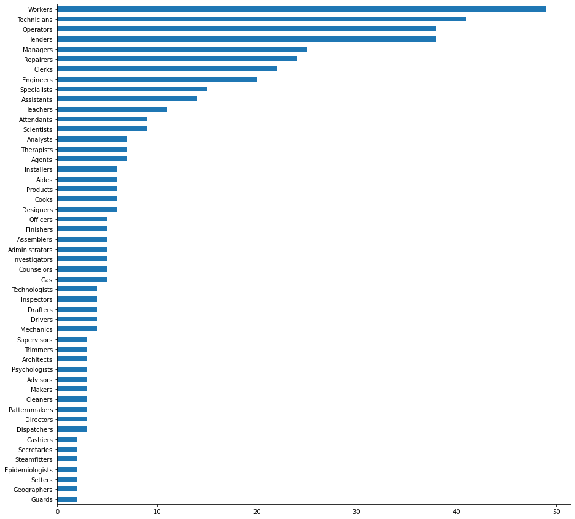
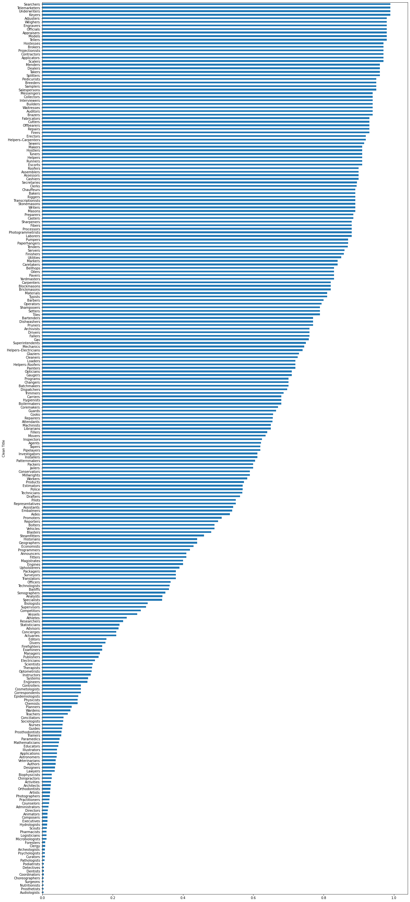
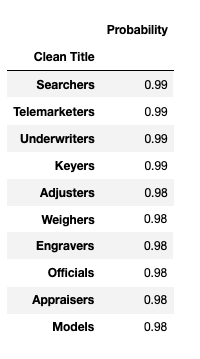
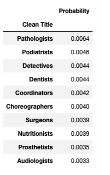
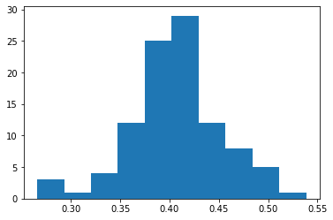
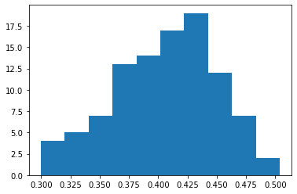

# Predicting Automation
### UC San Diego SOCI 136 - Final Project
#### Brian Huang

# Abstract

Throughout the Spring Quarter, I've learned a lot about automation, AI, and the effect algorithms have on our society. From bias classification of race to misgendering of language to restructuring the traditional workplace today, AI and automation have had a tremendous impact on society today.

In my final project, I want to investigate and try to predict what features push a job towards being automated. In our investigation, we use a [dataset from Kaggle](https://www.kaggle.com/andrewmvd/occupation-salary-and-likelihood-of-automation) that compiles data from the US Bureau of Labor Statistics, providing us with information such as **Probability**, **Total Employment**, **Mean Annual/Hourly Salary**, and corresponding **Occupation**. We also drew on data from [SmartAsset](https://smartasset.com/checking-account/states-where-jobs-are-most-vulnerable-to-automation) to construct a dictionary of data containing the ranking of states where automation occurs the most.

# Summary of Findings

### Cleaning
Luckily for us, both the `Automation` and `Salary` datasets came relatively clean. The `Automation` dataset had no missing values at all, meaning we did not have to do any sort of imputation. All the data types in the `Automation` dataset were also correct, meaning we did not have to do anything to tidy up our data.

The `Salary` dataset did pose some problems for us. Since the dataset was formatted as an excel file, many values that were missing were filled with either a `*` or a `#`. A lot of the values that were missing were present in the `A_MEDIAN`, `A_PCT75`, and `A_PCT90` columns. This makes sense, as many niche jobs or management jobs tend to lack a median salary or upper bound on salaries. One thing to note is that the three columns are all dependent on each other. If one value is missing, all subsequent values will be missing. For example, if I am missing a value in my `A_MEDIAN`, both `A_PCT75` and `A_PCT90` will also be missing values.

In order to impute our data, we have a few approaches. We could fill them in with zero or drop the data, but both of these options would heavily bias our data. Filling in with zero would bias our salaries lower, while dropping the data is risky as over twenty of our rows having missing values, and dropping all of them would be around `5%` of our data being omitted. 

If we observe the histograms of the distributions of the salaries, we see that for all percentiles, our salary is heavily right skewed:
<br>

<br>
Since it's right skewed for all of our data, we can't apply any sort of normal distrubition imputation. We also can't use a Chi-Squared or Gamma distribution. When we plot our data, we see that it is mostly linear, so our best option for imputing the data is using a Linear Regression model.
<br>

<br>

**A note**: We did drop three rows. `Dancers`, `Singers/Musicians`, `Actors`. We dropped these rows as they had no salary data. This makes sense as these roles often receive variable compensation.

Using sklearn, we imputed the missing percentile values:
``` Python
    median_pct25 = LinearRegression()
    X = df.dropna()['A_PCT25'].values.reshape(-1, 1)
    y = df.dropna()['A_MEDIAN']

    median_pct25.fit(X, y)
    median_pct25.score(X, y) 
    
    def median_impute(row):
    if np.isnan(row.A_MEDIAN):
        #check if it is null
        return median_pct25.predict(np.array(row.A_PCT25).reshape(-1, 1))[0]
        #plug in the value we want for our prediction
    else:
        return row.A_MEDIAN
        #if it isn't null keep the original value
        
    df['A_MEDIAN'] = df.apply(median_impute, axis = 1)
    df_with_states['A_MEDIAN'] = df_with_states.apply(median_impute, axis = 1)
    #we're applying column wise
```
## Exploratory Data Analysis
After cleaning our dataset, we're now able to investigate our dataset! Since our main goal is to predict the probability a job title gets automated, we need to take all the unique jobs and find a way to aggregate (group) them together.

My approach to this was to take a given job title, split it into it's word components, and extract the role from that list of words. In order to do this, we split each word into a list and grab the words that end with the letter `'s'`. This is because roles in our dataset tend to end with the letter `'s'` (Managers, Executives, Engineers, Painters, etc). From our list of words ending in the ltter `'s'`, we grab the last word as usually roles come last in a sentence. If we do not have words that end with an `'s'`, we just grab the last word in the list as once again, the last word in a job title tends to be correlated with the job at hand.

For example:
> `Marketing Operations Managers` becomes `['Marketing', 'Managers']`, which when filtered down becomes `['Operations', 'Managers']` which ends up giving us `'Managers'`

When we are missing a word that ends with `'s'`, we get an example like this:
> `Postsecondary Teacher` becomes `['Postsecondary', 'Teacher']`, which ends up giving us `'Teacher'` since we just extract the last word of the sentence.

```Python
    def job_finder(lst):
        '''
        This helper functions takes in a list and checks for
        if a word ends with the letter 's'. It then returns the 
        last word in the list of words that end with 's'.

        If no word ends in 's', it returns the last word in the sentence/list.
        '''
        word = list(filter(lambda x: x.endswith('s'), lst))
        #get a list of words that end with s
        if len(word) != 0:
            return word[-1]
            #if we have words that end with s we return the last word
        else:
            return lst[-1]
            #we just return the last word if it doesn't have 's'
```

Once we have a list of the types of jobs in our dataset, we can group and view some interesting aggregates of our data.

Some interesting plots are:

### The Top 50 Most Common Jobs


<br>
### The Probability of Specific Jobs Being Automated
This is sorted in descending order


### Top 10 Most Likely to be Automated

### Top 10 Least Likely to be Automated

<br>
**When we look at our data a lot of these probabilities seem accurate.**

`Telemarketers`: The annoying spam callers are without a doubt facing automation, especially with the envoy of new cutting edge speech and NLP AI's. Most advertisement calls, interviewing scheduling calls, and even scam calls are now automated.
<br>
`Appraisers`: Most appraisal can now be done using some sort of Machine Learning Model.
<br>
`Weighers`: We can use AI to weigh a majority of stuff. Electronic Scales, etc.
<br>
`Officials`: For sports, most timing and referee work can be done with cameras that catch images at a high FPS. Most officials tend to be volunteers now (Swimming, Rowing, Soccer, etc).
<br>
`Surgeons`: Although they did do [surgery on a grape](https://www.uchicagomedicine.org/forefront/surgery-articles/they-did-surgery-on-a-grape-and-we-did-a-q-and-a-with-a-surgeon-about-it), we should not expect any automation of surgeons anytime soon.
<br>
`Detectives`: Jobs that require high levels of critical thinking are not likely to face automation anytime soon.
<br>
`Dentists`: Jobs that require fine motors skills or high skill in general are automation safe, for now.
<br>

**Some observations make less sense though:**
<br>
<br>
`Models`: I'm not quite sure how we would automate things such as fashion and runway models. Maybe people enjoy seeing digital versions of their clothes? This left me a bit confused.

## Models and Feature Engineering
When trying to figure out how to predict our data, since we're using salaries and job counts to predict probability, it's likely best for us to use a Regression model. A classifier wouldn't make much sense here. The three types of Regression we're going to try are `LinearRegression()`, `RandomForestRegression()`, and `DecisionTreeRegressor()`.

We also need to select what features we want to use for our baseline model!
<br>
<br>
The features we are dropping are `['SOC', 'OCC_CODE', 'OCC_TITLE', 'OCC_GROUP']`
<br>
<br>
**The reasons why we're dropping each column is:**
<br>
<br>
`SOC`: We're dropping this column. While it is numeric, it's actually a categorical variable that identifies what the unique job is. As so, it will contribute nothing to our model and its predictions.
<br>
<br>
`OCC_CODE`, `OCC_TITLE`, `OCC_GROUP`: Two of these are repeated iterations of `SOC` and `OCCUPATION` left from our inner merge earlier. `OCC_GROUP` is also not very useful as it's just grouping of jobs and their types. We can drop this.


When creating our baseline model, `LinearRegression()` ended up working out the best. Both tree regressors ended up giving very low scores for fitting our model. For the rest of our modeling, we stuck with `LinearRegression()`. The baseline model is attached below.

```Python
    standard_scale = ['TOT_EMP', 'EMP_PRSE', 'A_MEAN', 'MEAN_PRSE', 'A_PCT10', 'A_PCT25',
       'A_MEDIAN', 'A_PCT75', 'A_PCT90']
    ohe = ['Clean Title', 'Occupation']

    preproc = ColumnTransformer(
    transformers = [
        ('standard', StandardScaler(), standard_scale),
        ('one_hot', OneHotEncoder(handle_unknown = 'ignore'), ohe)
    ])

    pl = Pipeline(steps = [('preprocessing', preproc), ('regressor', LinearRegression())])
```

Here are the distribution of scores for our baseline model:
```Python
    scores = []
    for _ in range(100):
        f_train, f_test, o_train, o_test = train_test_split(features, outcome, test_size = 0.3)
        pl.fit(f_train, o_train)
        scores.append(pl.score(f_test, o_test))
    plt.hist(scores)
```


The features we engineered to try and improve our model were:
<br>
`Clean Title (OHE)` - This is a one-hot encoded column containing the job title we used to aggregate our jobs on earlier.
<br>
`State Proportions` - This is the proportion of the occupation in each state over the total number of jobs in the United States. Having a proportion lets us know how prevalent a job is in each state. (number of jobs per state/total jobs)
<br>
`Total Economic Contribution` - How much does this job contribute to our GDP? (mean wage * total employees)
<br>
`Median Salary (Binarized)` - A true or false column indicating if Median Salary is greater than what the US considers as upper-middle class salary ($150,000).
<br>
`Most Common State` - A column containing the state where the occupation is most common.
<br>
`Ordinal State Ranking` - A column that ranks states ordinally (drawn from Bureau of labor) and percent risk of automation also from Bureau of labor

For our final model, we were able to improve predictions slightly, but not by much. The final model is attached below:
```Python
    as_is = ['STATE_RANKING', 'STATE_AUTOMATION']
    standard_scale = ['TOT_EMP', 'A_MEAN', 'A_PCT10', 'A_PCT25',
           'A_MEDIAN', 'A_PCT75', 'A_PCT90', 'ECONOMIC_CONTRIBUTION']
    ohe = ['Clean Title', 'Occupation', 'BIGGEST_STATE']
    binarize = ['LARGE_SALARY']
    states = ['Alabama', 'Alaska', 'Arizona',
            'Arkansas', 'California', 'Colorado', 'Connecticut', 'Delaware',
            'District of Columbia', 'Florida', 'Georgia', 'Hawaii', 'Idaho',
            'Illinois', 'Indiana', 'Iowa', 'Kansas', 'Kentucky', 'Louisiana',
            'Maine', 'Maryland', 'Massachusetts', 'Michigan', 'Minnesota',
            'Mississippi', 'Missouri', 'Montana', 'Nebraska', 'Nevada',
            'New Hampshire', 'New Jersey', 'New Mexico', 'New York',
            'North Carolina', 'North Dakota', 'Ohio', 'Oklahoma', 'Oregon',
            'Pennsylvania', 'Rhode Island', 'South Carolina', 'South Dakota',
            'Tennessee', 'Texas', 'Utah', 'Vermont', 'Virginia', 'Washington',
            'West Virginia', 'Wisconsin', 'Wyoming']

    preproc = ColumnTransformer(
    transformers = [
        #('states', FunctionTransformer(lambda x: x/sum(features_state_df['TOT_EMP'])), states),
        #take the proportion of jobs in the US
        ('binarize', Binarizer(), binarize),
        ('as_is', FunctionTransformer(lambda x: x), as_is),
        ('standard', StandardScaler(), standard_scale),
        ('one_hot', OneHotEncoder(handle_unknown = 'ignore'), ohe)
    ])

    pl = Pipeline(steps = [('preprocessing', preproc), ('regressor', LinearRegression())])
```

Here are the distribution of scores for our final model:
```Python
    scores = []
    for _ in range(100):
        f_train, f_test, o_train, o_test = train_test_split(features, outcome, test_size = 0.3)
        pl.fit(f_train, o_train)
        scores.append(pl.score(f_test, o_test))
    plt.hist(scores)
```


## Conclusions and Findings
Even after extensive feature engineering, we were not able to increase the accuracy of the model by much. With just salary and total number of employees present in the US, we are not able to make consistently accurate predictions of jobs and their probabilites of being automated. The highest accuracy we had was around `50%`, which is not reliable enough for practical application. For future projects, sourcing from more sources to get more data could generate a more reliable prediction model.

In terms of other findings, the dataset itself provided a very insightful look into the jobs that are being automated right now and what the salaries of those jobs and employee count of those jobs look like. We see that mostly white-collar work (low-skill entry, decent salary) jobs are being automated away. High skill jobs tend to be harder to automate, so logically they are the hardest to automate away. Interesingly enough, programming itself is a job that sits in the middle of the automation distribution. It's likely basic programming tasks are slowly being automated away.

Does this mean automation is bad per se? No it doesn't. Automation itself produces new jobs, just as it takes away the old. Automation is inevitable and we shouldn't fight it, but we should take steps to ensure the automation is done in a way ensures the lifestyles of people working in a traditional setting are not uprooted by innovation.
